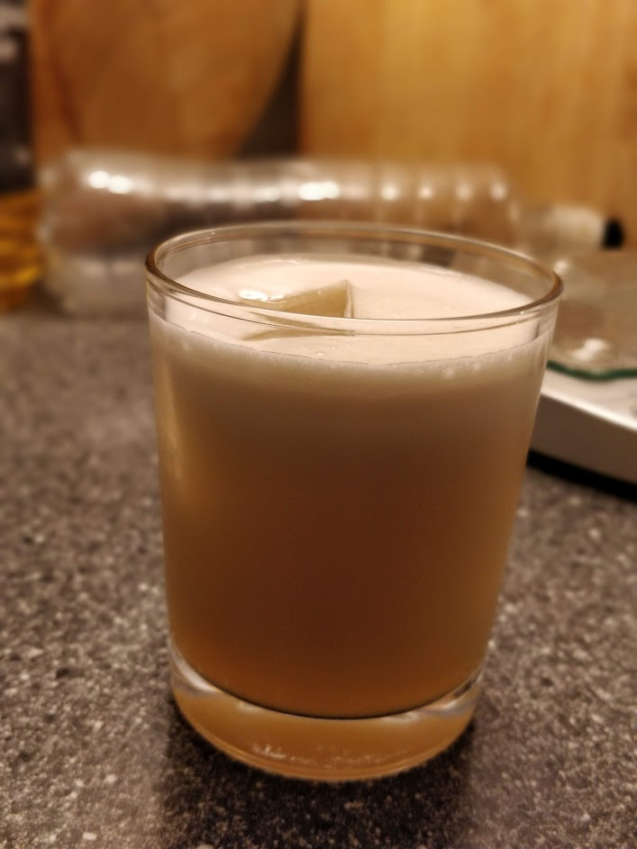
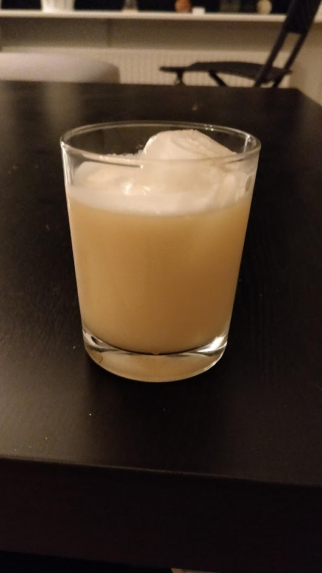

 - **1½** Amaretto
 - **1** Bourbon
 - **1 half** Squeezed Lemon
 - **1 tsp** Rich Simple Syrup
 - Egg White
 **Garnish**: Maraschino Cherry / Lemon twist / both
 **Process**: Do a Dry Shake or Reverse Dry Shake all ingredients. Strain into glass (with ice depending on the glass).

**Idea**:  *Try a cask-strength bourbon as Morgenthaler originally specified (e.g. [Booker's](https://www.calle.dk/pi/Booker-s-Bourbon-Small-Batch-Bourbon-Collection-64-2%25-0-7-l-_1723024_48139.aspx?languageid=1&countryid=11&currencyid=54) as the main man use himself)*
**Idea**:  *Try [Morgenthalers](https://jeffreymorgenthaler.com/i-make-the-best-amaretto-sour-in-the-world/) original ratio*

Discovered this drink in a cocktail bar in Barcelona. Have been trying to recreate it ever since.

## Maker's Mark Version 2
 - **1½** Amaretto
 - **1** Bourbon
 - **1 half** Squeezed Lemon
 - **1 tsp** Rich Simple Syrup
 - Egg White

The foam is way better with a real egg white.  
Maybe a bit too sour ? 

**Idea**:  *Try a cask-strength bourbon as Morgenthaler originally specified (e.g. [Booker's](https://www.calle.dk/pi/Booker-s-Bourbon-Small-Batch-Bourbon-Collection-64-2%25-0-7-l-_1723024_48139.aspx?languageid=1&countryid=11&currencyid=54) as the main man use himself)*
**Idea**:  *Try [Morgenthalers](https://jeffreymorgenthaler.com/i-make-the-best-amaretto-sour-in-the-world/) original ratio*

## Maker's Mark Version 1
- **1½x** Amaretto
- **1½x** Maker's Mark Bourbon (~40%)
- **1.25** Lemon Juice
- **1 tsp** Rich Simple Syrup
- Egg White

## Bulleit Version 1
Decent, but not overwhelming. You can taste all the ingredients, but none of them too much.

- **1½x** Amaretto
- **2x** Bulleit Bourbon (Increased due to Amaretto overwhelming otherwise. With a stronger bourbon this might not be necessary)
- **1.25** Lemon Juice
- **1 tsp** Rich Simple Syrup

## Modern (Morgenthaler Formula)
Source: [Difford's Guide](https://www.diffordsguide.com/cocktails/recipe/3263/amaretto-sour-ii-morgenthaler-formula) (p.83), [Jeffrey Morgenthaler](https://www.jeffreymorgenthaler.com/i-make-the-best-amaretto-sour-in-the-world/), [H2D](https://www.youtube.com/watch?v=LJkdoA-qSgE)

Difford's is slightly modified. This is their version.

 - **1½x** Amaretto
 - **1x** Cask-proof Bourbon Whiskey
 - **1.25x** Lemon Juice
 - **½x** Egg White
 - **1 tsp** Rich Simple Syrup

## Classic Recipe
Source: [Difford's Guide](https://www.diffordsguide.com/cocktails/recipe/53/amaretto-sour) (p.83)

 - **2x** Amaretto
 - **1x** Lemon Juice
 - **½x** Egg White
 - **1 dash** Angustora Aromatic Bitters (A few more might balance the drink better according to Difford)

 **Process**: Do a Dry Shake or Reverse Dry Shake all ingredients. Strain into glass (with ice depending on the glass).

## Sources & Inspiration
 - [Difford's Guide](https://www.diffordsguide.com/cocktails/recipe/3263/amaretto-sour-by-jeffrey-morgenthaler)
 - [Jeffrey Morgenthaler](https://jeffreymorgenthaler.com/i-make-the-best-amaretto-sour-in-the-world/)
 - [How To Drink](https://www.youtube.com/watch?v=LJkdoA-qSgE&feature=emb_title)

[version1]: Amaretto_Sour_V1.jpg  
[version2]: Amaretto_Sour_V2.jpg
