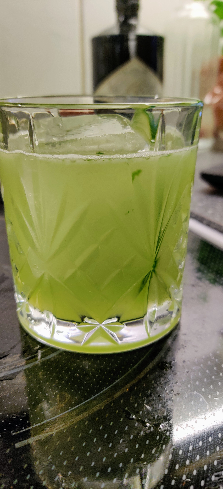

# Basil & Cucumber Smash

 - 4 cl Gin (Hendrick's is apparently good for this)
 - 3 cl Lime Juice
 - 2 cl Sugar Syrup
 - 8-10 Basil Leaves
 - 8-10 Slices of cucumber
 
**Process**: Muddle basil and cucumber with syrup in the shaker. Add the rest and shake. Strain into glass. 
 
 Very good and refreshing.

 [version1]: gin_cucumber_basil_smash_v1.jpg  